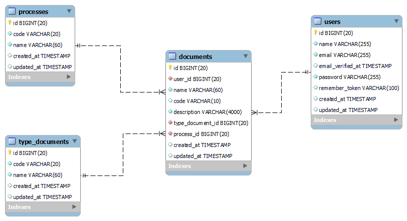

<!-- 

 -->

# Diagrama Entidad Relación

# 1.¿Cuáles son los requisitos del servidor para activar el script?
## Respuesta: Para instalar el Script los requisitos mínimos del servidor son:

- [Php version 8.2+]
- [MySQL 10.4+-MariaDB]
- [mod_rewrite Apache]
- [BCMath PHP Extension]
- [Ctype PHP Extension].
- [Mbstring PHP Extension]
- [PDO PHP Extension]
- [Tokenizer PHP Extension]
- [Session PHP Extension]

En la mayoría de los servidores, estas extensiones están activadas por defecto, pero debe consultar a su proveedor de alojamiento.

# 2.¿Cómo instalar el script?
## Respuesta: Para instalar el script siga los siguientes pasos.

- Extraiga el archivo .zip descargado en su PC o el código directamente desde GitHub.
- Cargue el archivo .zip en el directorio public_html de su servidor o en cualquier otro directorio en el que desee ejecutar.
- Extraiga el archivo zip en ese directorio.
- Cree una nueva base de datos a partir de la base de datos MySQL de su servidor.
- Cree un usuario DB para la base de datos y vincule esa base de datos al usuario DB.
- Configure las variables de entorno a partir del archivo .env-example.
- Escribe por la consola el comando `php artisan migrate fresh --seed`.
- Escribe el comando en una nueva consola `composer install`.
- Escribe el comando en una nueva consola `npm install`.
- Escribe el comando en una nueva consola `npm run dev`.
- Pulse en la URL amigable generada por el comando `php artisan serve`.
# 3.¿Cómo iniciar sesión al sistema?
## Respuesta: Para iniciar sesión en el sitema siga los siguientes pasos.

- Presione en el botón Log in.
- Navegar a la página de Log in
- Ingresar el campo Email el siguiente correo `test@example.com`.
- Ingresar el campo Password la siguiente contraseña `test12345`.
- Hacer clic en el botón de "Log in" para acceder al sistema.
- Si todo ha salido bien, saldrá el siguiente mensaje "You're logged in!".
# 4.¿Cómo registrarse en el sistema?
## Respuesta: Para registrarse en el sitema siga los siguientes pasos.

- Presione en el botón Register.
- Navegar a la página de Registe.
- Llenar los campos Name, Email, Password y Confirm Parssword.
- Hacer clic en el botón de "Register" para acceder al sistema.
- Si todo ha salido bien, saldrá el siguiente mensaje "You're logged in!".
# 5.¿Cómo crear un nuevo documento?
## Respuesta: Para agregar un documento nuevo en el sistema siga los siguientes pasos.

- Presione en el botón ubicado en Navbar superior donde dice "Documents".
- Navegar a la página de Documents.
- Hacer clic en el botón "Add" ubicado en la parte superior de la tabla "Documents".
- Será redirigido hacia el formulario "Create Document".
- Llenar los campos requeridos para crear un nuevo documento.
- Hacer clic él en botón "save", para guardar.
- Si todo ha salido bien, será redireccionado a la tabla de "Documents".
# 6.¿Cómo editar un documento?
## Respuesta: Para editar un documento registrado en el sistema siga los siguientes pasos.

- Hacer clic en el botón "Edit" ubicado dentro de la tabla "Documents".
- Será redirigido hacia el formulario "Edit Document".
- Editar los valores dentro del formulario.
- Hacer clic él en botón "save", para guardar.
- Si todo ha salido bien, será redireccionado a la tabla de "Documents".
# 7.¿Cómo eliminar un documento?
## Respuesta: Para eliminar un documento registrado en el sistema siga los siguientes pasos.

- Hacer clic en el botón "Delete" ubicado dentro de la tabla "Documents".
- Se mostrará una modal de confirmación.
- Al hacer clic en el botón "Yes, delete" el registro será eliminado.
# 8.¿Cómo buscar por documento?
## Respuesta: Para buscar por documento en el sistema siga los siguientes pasos.

- Hacer clic sobre el campo "Search" ubicado en la parte superior derecha de la tabla "Documents".
- Escribe el texto a buscar.
- Serán mostrados los datos dentro de la tabla que coincidan con la búsqueda.
# 9.¿Cómo cerrar sesión?
## Respuesta: Para cerrar sesión en el sistema siga los siguientes pasos.

- Hacer clic en el botón "Dashboard" ubicado en la parte superior izquierda del Navbar.
- Será redirigido hacia el "Dashboard" del sistema.
- Hacer clic en el botón "Profile" del usuario, ubicado en la parte superior derecha del Navbar.
- Hacer clic él en botón "Log Out", para cerrar sesión.
- Si todo ha salido bien, será redireccionado a la página inicio del sistema.
